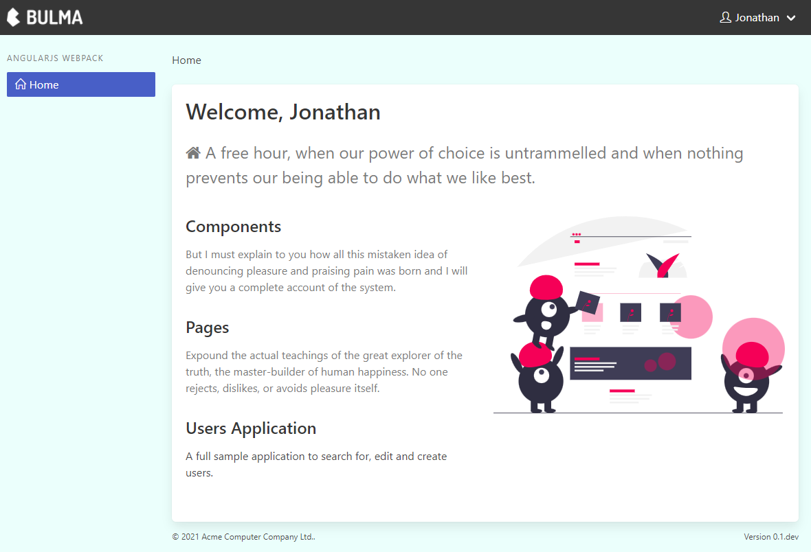

# angularjs-webpack

An example [AngularJS](https://angularjs.org/) application that uses [Webpack](https://webpack.js.org/) for serving development builds and bundling for production.

## Overview

Although `AngularJS` is now deprecated, supporting existing applications might still be required using modern tooling.

These apps don't warrant the engineering effort to port them to another framework since they're likely to be replaced by other things in the next 18 months.

These apps were based on boilerplate from [John Papa's](https://johnpapa.net/) excellent [Pluralsight](https://pluralsight.com/) courses:

- `Gulp` for serving development builds and bundling for production.
- `JSHint` and `JSCS` for code style, configured to match the [Angular 1 Style Guide](https://github.com/johnpapa/angular-styleguide/blob/master/a1/README.md).
- `Bower` for dependencies.

This sample demonstrates using modern tooling to build AngularJS applications, without having to rewrite the applications.

It is based on the configuration generated by [Create React App](https://create-react-app.dev/) but adapted for AngularJS.



## Requirements

- Require as few changes as possible to the application source code. Only make changes as a last resort.
  - Most `AngularJS`/`Webpack` samples involve converting the sources to component format as a precursor to converting the application to `Angular 2+`.
- Dependencies from [npm](https://www.npmjs.com/). Not much gets added to [bower](https://bower.io/) anymore since it's also deprecated.
- Use modern tooling:
  - [Babel](https://babeljs.io/) for transpiling to allow new code to use modern Javascript ES6 features like arrow functions.
  - [ESlint](https://eslint.org/) to replace [JSHint](https://jshint.com/) and [JSCS](https://jscs-dev.github.io/)
  - [Webpack](https://webpack.js.org/) to replace [Gulp 3](https://gulpjs.com/) for serving development builds and bundling production builds.
  - [Prettier](https://prettier.io/) for automatically formatting source code.
- Keep the original [Karma](https://karma-runner.github.io/)/[Jasmine](https://jasmine.github.io/) unit tests.
- Don't worry about any [Protractor](https://www.protractortest.org/) tests since [Protractor is EOL](https://github.com/angular/protractor/issues/5502) now.

## Installation

Download the source from Github and run `npm install` from the project directory.

## Available Scripts

In the project directory, you can run:

### `npm start`

Runs the app in the development mode.\
Open [http://localhost:3000](http://localhost:3000) to view it in the browser.

The page will reload if you make edits.\
You will also see any lint errors in the console.

### `npm test`

Launches the `Karma` test runner and runs all unit tests once.

### `npm run test:watch`

Launches the `Karma` test runner in the interactive watch mode.

### `npm run build`

Builds the app for production to the `dist` folder.\
It optimizes the build for the best performance. The build is minified and the filenames include the hashes.

To run the production build, type `npx serve ./dist`

### `npm run analyze`

Runs `webpack-bundle-analyzer` in server mode.

### `npm run lint`

Runs the application's files through `ESlint` and `Prettier` to verify code style and correctness.

### `npm run clean`

Cleans the `dist` folder.

### `npm run format`

> Warning: This command reformats all your source code to match `Pretter's` style.

## An update from doing this in practice

In general, this was pretty easy to do:

1. Migrate dependencies to `NPM` via `package.json`. Where a library does not exist on `NPM`, use the special github syntax to reference it (which is effectively what `bower` did previously):

```json
{
  "dependencies": {
    "ng-dialog": "^1.4.0",
    "ng-percentage-filter": "github:timhettler/ng-percentage-filter"
  }
}
```

2. Update `app.module.js` to import the required modules and register them:

```js
import angular from 'angular';
import 'angular-animate';
import 'angular-sanitize';
import 'angular-cookies';
import 'angular-ui-router';
import 'angular-translate';
import 'angular-dynamic-locale';

angular.module('app', [
  // Angular modules
  'ngSanitize',
  'ngAnimate',
  'ngCookies',

  // Custom modules

  // 3rd Party Modules
  'pascalprecht.translate',
  'tmh.dynamicLocale',
  'ui.router'
]);
```

3. Unfortunatley, the `Karma` tests did need a slight change as `angular-mock`'s `module` conflicts with `Webpack`'s `module`. The simplest way to resolve this was just adding the `window.` prefix:

```js
beforeEach(window.module('app', { svgImageDirective: {} }));
```

Or reference `angular-mocks` in full:

```js
beforeEach(angular.mock.module('app', { svgImageDirective: {} }));
```

4. Adding `AngularJS` locales. It was easier to add the languages we support to the `public/locales` folder rather than trying to reference them from the `NPM` package and have `angular-dynamic-locale` load them as required. The localisation files for the application itself are served via a Webpack chunk (see `src/locales`).

5. Done!
